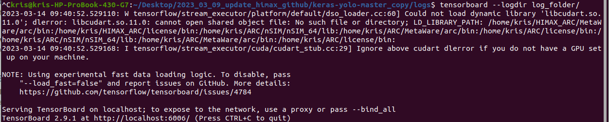
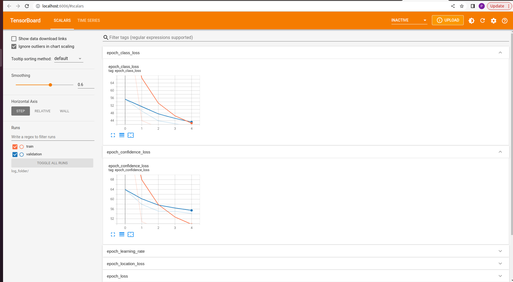

# Tensorflow Keras Yolo-Fastest/Yolo-Fastest XL with Model Optimization 
This repository contains the 80 object categories detection settings of the Yolo-Fastest series models on the [COCO dataset](https://cocodataset.org/#home). It also shows how to train from scratch using Tensorflow Keras and then does the Model Optimization which including of pruning, clustering and quantization. The models architecture are referenced from [dog-qiuqiu/Yolo-Fastest](https://github.com/dog-qiuqiu/Yolo-Fastest). 

We use [Tensorflow Model Optimize Toolkit](https://www.tensorflow.org/model_optimization) and the [Arm vela compiler](https://review.mlplatform.org/plugins/gitiles/ml/ethos-u/ethos-u-vela) to achieved 50% sparsity with minimal accuracy loss when computing with 8-bit quantized weights, significantly reducing the Off-chip flash size and the SRAM size at the Yolo-Fastest and Yolo-Fastest XL, which does [Pruning](https://www.tensorflow.org/model_optimization/guide/pruning) , [Clustering](https://www.tensorflow.org/model_optimization/guide/clustering) and [Quantization](https://www.tensorflow.org/model_optimization/guide/quantization/training_comprehensive_guide). After doing the MOT and vela compiling, the Yolo-Fastest and Yolo-Fastest XL could run on the edge device with good results, such as [HIMAX WE2](https://www.himax.com.tw/zh/products/intelligent-sensing/always-on-smart-sensing/wiseeye2-ai-processor/). You can also deploy the model to HIMAX WE2 by reference the [HimaxWiseEyePlus/ML_FVP_EVALUATION](https://github.com/HimaxWiseEyePlus/ML_FVP_EVALUATION) repository.The following form is our model result.

- Yolo-Fastest XL 

|`Model`         | Yolo-Fastest XL  | Yolo-Fastest XL | Yolo-Fastest XL MOT| Yolo-Fastest XL  | Yolo-Fastest XL | Yolo-Fastest XL MOT| 
| :---         |  :---:         | :---:         |     :---:      |  :---:         | :---:         |     :---:      | 
| `input size`  | RGB 320x320x3    |RGB 320x320x3    | RGB 320x320x3    | RGB 256x256x3    |RGB 256x256x3    |RGB 256x256x3 
| `MOT`    | X    | X  | O    | X    | X  | O    |
| `COCO AP50`    | 33.8    | 33.8  | 32.8   |29.9| 29.9 | 28.9|
| `vela version`    | 3.9.0    | 3.9.0   | 3.9.0     | 3.9.0    | 3.9.0   | 3.9.0     |
| `Optimise SRAM Size by Vela`    | X  |   O   | O    | X  |   O   | O    |
| `Total SRAM(KB)`    | 1602.03 | 820.00 |  820.00  | 1026.03  | 528.00 | 528.00 |
| `Total Off-chip Flash(KB)`    | 1131.09    | 1182.86   | 893.89  | 1140.09 | 1184.58 | 894.80|
| `Total cycles  (cycles/batch)`| 25189173  | 26369181   | 24168662 |18067016 | 18684296 |16313760|
| `Batch Inference time (inferences/s)`    | 15.88  | 15.17  | 16.55  |22.14 | 21.41 | 24.52| 

- Yolo-Fastest

|`Model`         | Yolo-Fastest  | Yolo-Fastest  | Yolo-Fastest MOT  |  Yolo-Fastest   |Yolo-Fastest   |Yolo-Fastest MOT   |
| :---         |   :---:      |  :---:         |    :---:         | :---:         |  :---:           |:---:         | 
| `input size`  | RGB 320x320x3    |RGB 320x320x3    | RGB 320x320x3    |RGB 256x256x3    |RGB 256x256x3 |RGB 256x256x3 |
| `MOT`    | X    | X  | O    | X    | X  | O    |
| `COCO AP50`    | 23.9    |23.9    |22.5 | 20.9 | 20.9   |19.6        |
| `vela version`    | 3.9.0     |3.9.0    |3.9.0  |3.9.0  | 3.9.0    |3.9.0       |
| `Optimise SRAM Size by Vela`    | X  |   O   | O    | X  |   O   | O    |
| `Total SRAM(KB)`    | 1200.91        |820.00      |820.00          | 768.91   |528.00| 528.00|
| `Total Off-chip Flash(KB)`    | 505.31           |548.70       |429.70   |511.52   |545.64 | 432.28 |
| `Total cycles  (cycles/batch)`    | 13216617           |13588601        |12803345  |9097664            |9224696        |8559640|
| `Batch Inference time (inferences/s)`    | 30.26            |29.44        |31.24         | 43.97            |43.36        | 46.73 |


### Prerequisites
- Python==3.8.10
- tensorflow==2.11.0
- You can install required packages by following command on Ubuntu 20.04 LTS.
    ```
    pip install -r requirements.txt
    ```
### Dataset and Annotation files
- To get the COCO 2017 dataset can refer to [COCO dataset download page](https://cocodataset.org/#download) to download COCO 2017 train images dataset and COCO 2017 val images dataset.
- Change each dataset path at data list files which are `./tools/dataset_label/linux/train2017.txt` and `./tools/dataset_label/linux/val2017.txt` to your own root of COCO dataset path.
    - For example
        ```
        [Root of COCO dataset path]/val2017/000000184321.jpg 162,173,267,286,6
        ```
### Config setting
- Please make sure that the `./core/config.py` is the same as following initial config setting. 
    ```
    vim ./core/config.py

    # YOLO options
    __C.YOLO = edict()
    __C.YOLO.darknettxt = False
    __C.YOLO.ignore_thresh = 0.5
    __C.YOLO.iou_thresh = 0.213
    __C.YOLO.L2_FACTOR = 0.0005
    __C.YOLO.ACT_TYPE = 'relu6' # leaky relu relu6
    __C.YOLO.max_boxes = 200
    __C.YOLO.warmup_epochs = 1
    __C.YOLO.input_shape = (320, 320, 3) # (None, None, 3)
    __C.YOLO.fixshape = False
    __C.YOLO.grayscale = True

    # MOT options
    __C.MOT = edict()
    # pruning
    __C.MOT.final_sparsity = 0.5
    __C.MOT.frequency = 3696
    # cluster
    __C.MOT.number_of_clusters = 16
    __C.MOT.preserve_sparsity = True
    __C.MOT.cluster_centroids_init = 'KMEANS_PLUS_PLUS' # LINEAR # KMEANS_PLUS_PLUS # DENSITY_BASED
    #QAT
    __C.MOT.qat_mode = 'pcqat' # qat pqat pcqat cqat
    ```

### Training
- Yolo-Fastest XL
    - Train from scratch
        - The following command is how to train the yolo_fastest_xl model from scratch.
            ```
            python train.py --model_type yolo_fastest_xl --anchors_path ./cfg/yolo-fastest-xl-anchors.txt --model_image_size 320x320 --annotation_file ./tools/dataset_label/linux/train2017.txt --val_annotation_file ./tools/dataset_label/linux/val2017.txt --multi_anchor_assign --log_path [log_path]
            ```
    - Train with pre-trained weight
        - If you want to train with pre-trained weight. The following command is how to train the yolo_fastest_xl model from pre-train weight.
            ```
            python train.py --model_type yolo_fastest_xl --anchors_path ./cfg/yolo-fastest-xl-anchors.txt --model_image_size 320x320 --annotation_file ./tools/dataset_label/linux/train2017.txt --val_annotation_file ./tools/dataset_label/linux/val2017.txt --multi_anchor_assign --log_path [log_path] --weights_path [weights_path]
            ```
- Yolo-Fastest
    - Train from scratch
        - The following command is how to train the yolo_fastest model from scratch.
            ```
            python train.py --model_type yolo_fastest --anchors_path ./cfg/yolo-fastest-anchors.txt --model_image_size 320x320 --annotation_file ./tools/dataset_label/linux/train2017.txt --val_annotation_file ./tools/dataset_label/linux/val2017.txt --multi_anchor_assign --log_path [log_path]
            ```
    - Train with pre-trained weight
        - The following command is how to train the yolo_fastest model from pre-trained weight.
            ```
            python train.py --model_type yolo_fastest --anchors_path ./cfg/yolo-fastest-anchors.txt --model_image_size 320x320 --annotation_file ./tools/dataset_label/linux/train2017.txt --val_annotation_file ./tools/dataset_label/linux/val2017.txt --multi_anchor_assign --log_path [log_path] --weights_path [weights_path]
            ```

### TensorBroad
- Install tensorboard package
    - TensorBoard is a suite of web applications for inspecting and understanding your TensorFlow runs and graphs.
        ```
        pip install tensorboard
        ```
- Key-in following command to inspect your training progress.
    ```
    tensorboard --logdir [log_path]
    ```
- You will see the terminal displaying the following message. And just click the link.
    
- You can see your training progress.
    


### Model Optimization (MOT)
- Pruning
    - The following command is how to do pruning optimization to your model.
    ```
    python train.py --model_type yolo_fastest_xl --anchors_path ./cfg/yolo-fastest-xl-anchors.txt --model_image_size 320x320 --annotation_file ./tools/dataset_label/linux/train2017.txt --val_annotation_file ./tools/dataset_label/linux/val2017.txt --multi_anchor_assign --decay_type none --learning_rate 1e-5 --total_epoch 135 --model_pruning --log_path [log_path] --weights_path [weights_path] 
    ```

- Cluster
    - Fine-tune the pre-trained model with clustering.
    - The following command is how to do clustering optimization to your model.
    ```
    python train.py --model_type yolo_fastest_xl --anchors_path ./cfg/yolo-fastest-xl-anchors.txt --model_image_size 320x320 --annotation_file ./tools/dataset_label/linux/train2017.txt --val_annotation_file ./tools/dataset_label/linux/val2017.txt --multi_anchor_assign --decay_type none --learning_rate 1e-5 --total_epoch 135 --model_clustering --log_path [log_path] --weights_path [weights_path] 
    ```
- Quantization Aware Training (QAT)
    - The following command is how to quantize floating model to int8 tflite model by QAT method.
    ```
    python train.py --model_type yolo_fastest_xl --anchors_path ./cfg/yolo-fastest-xl-anchors.txt --model_image_size 320x320 --annotation_file ./tools/dataset_label/linux/train2017.txt --val_annotation_file ./tools/dataset_label/linux/val2017.txt --multi_anchor_assign --decay_type none --learning_rate 1e-5 --total_epoch 135 --model_qat --log_path [log_path] --weights_path [weights_path] 
    ```
- MOT resume 
    - If you want to resume model optimization, you can add the argument,`--reload_path [reload_path]`, at command line while doing MOT and do not add the argument,`--weights_path [weights_path] `.
    - Example of puring resume command,
    ```
    python train.py --model_type yolo_fastest_xl --anchors_path ./cfg/yolo-fastest-xl-anchors.txt --model_image_size 320x320 --annotation_file ./tools/dataset_label/linux/train2017.txt --val_annotation_file ./tools/dataset_label/linux/val2017.txt --multi_anchor_assign --decay_type none --learning_rate 1e-5 --total_epoch 135 --model_pruning --log_path [log_path] --reload_path [reload_path]
    ```
    - Hint: Pay attention about the [reload_path] which you should use the `.h5` file name without `-prun`. 
    - For example, while you see two files named `ep001-loss83.236-val_loss93.097.h5` and `ep001-loss83.236-val_loss93.097-prun.h5` at [log_path], you should choose the `ep001-loss83.236-val_loss93.097.h5` to do the MOT resume.

### Pre-trained weight
- We provide fastest and fastest xl pre-trained weights under the folder of `pretrained_weights`.

### Evaluation
- You can see the evaluation result the following  command.
    ```
    python eval_tflite_json_demo_BY_output_image.py --model_path [model path about tflite] --anchors_path [anchor file about yolo fastest or fastes xl] --annotation_file [evaluate annotation file path] --output_image_path [path of output image folder] --model_image_size [model input size <height>x<width>]
    ```

- You can see the evaluation the average percision (AP) the following  command.
    ```
    python eval_tflite_json_demo_BY.py --model_path [model path about tflite] --anchors_path [anchor file about yolo fastest or fastes xl] --annotation_file [evaluate annotation file path] --model_image_size [model input size <height>x<width>]
    --json_name [the output json FILE name of evaluate result]
    ```

    ```
    #Use pycoco tool to caculate the average percision (AP)
    python pycooc.py --res_path [path of the output json FILE] --instances_json_file [path of coco_dataset/coco/annotations/instances_val2017.json]
    ```

### Appendix
- Options
    - Model (--model_type)
        Choices: [yolo_fastest_xl, yolo_fastest]
    - Optimizer (--optimizer)
        Choices: [SGD, SGDW, Adam, RMSprop]
    - Resolution (--model_image_size)
        Choices: [multiples of 32]
    - Activation function
        Choices: [leaky, relu, relu6]
    - Pruning
        final_sparsity: [0-100%]
    - Clustering
        number_of_clusters: [>0]
    - QAT
        QAT mode: [qat, pqat, cqat, pcqat]
